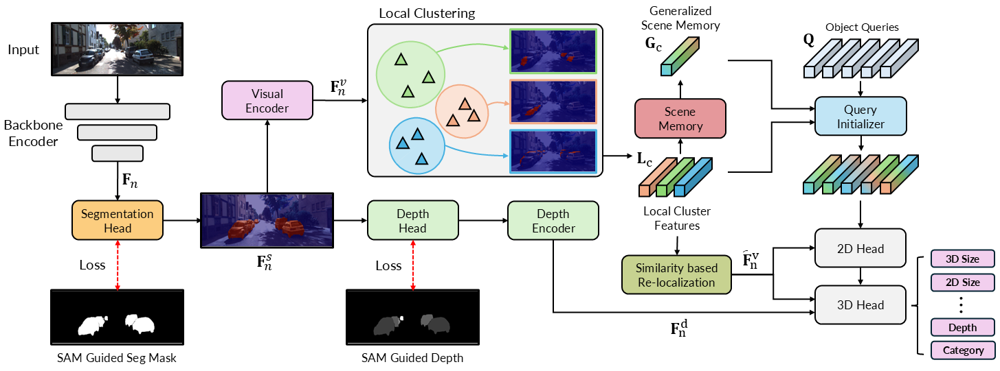
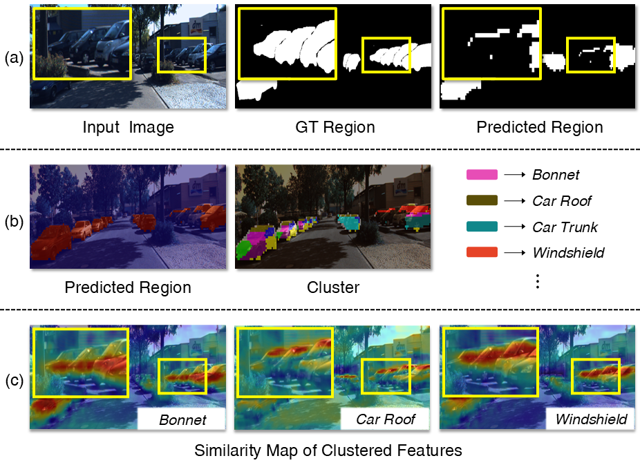

# MonoCLUE: Object-Aware Clustering Enhances Monocular 3D Object Detection

## Introduction
This repository provides the official implementation of [MonoCLUE: Object-Aware Clustering Enhances Monocular 3D Object Detection](https://arxiv.org) based on the excellent work [MonoDGP](https://github.com/PuFanqi23/MonoDGP). In this work, we propose a DETR-based monocular 3D detection framework that strengthens visual reasoning by leveraging clustering and scene memory, enabling robust performance under occlusion and limited visibility.
<div align="center">  </div> 

<div align="center">  </div>

## Main Result

Note that the randomness of training for monocular detection would cause a variance of ±1 AP<sub>3D|R40</sub> on KITTI.

The official results :
<table>
    <tr>
        <td rowspan="2",div align="center">Models</td>
        <td colspan="3",div align="center">Val, AP<sub>3D|R40</sub></td>   
        <td rowspan="2",div align="center">Logs</td>
        <td rowspan="2",div align="center">Ckpts</td>
    </tr>
    <tr>
        <td div align="center">Easy</td> 
        <td div align="center">Mod.</td> 
        <td div align="center">Hard</td> 
    </tr>
    <tr>
        <td rowspan="4",div align="center">MonoCLUE</td>
        <td div align="center">33.7426%</td> 
        <td div align="center">24.1090%</td> 
        <td div align="center">20.5883%</td> 
        <td div align="center"><a href="https://drive.google.com/file/d/1G51qlnwXMSD5zgRlXPCjkAjBWMlqbjdg/view?usp=drive_link">log</a></td>
        <td div align="center"><a href="https://drive.google.com/file/d/183zRv7EaR3ReS4QA9KTfLPbRRxwjHcqU/view?usp=sharing">ckpt</a></td>
    </tr>  
  <tr> 
        <td div align="center">31.5802%</td> 
        <td div align="center">23.5648%</td> 
        <td div align="center">20.2746%</td> 
        <td div align="center"><a href="https://drive.google.com/file/d/1bTqH3DCnN-PSjchHDX0yG52xsAdMCFPy/view?usp=drive_link">log</a></td>
        <td div align="center"><a href="https://drive.google.com/file/d/1Sa1J2m0dp0a34ILvWt7YMFl1jJHprDbC/view?usp=drive_link">ckpt</a></td>
    </tr>  
</table>

## Installation
1. Clone this project and create a conda environment:
    ```
    git clone https://github.com/SungHunYang/MonoCLUE.git
    cd MonoCLUE

    conda create -n monoclue python=3.8
    conda activate monoclue
    ```
    
2. Install pytorch and torchvision matching your CUDA version:
    ```bash
    pip install torch==2.4.1 torchvision==0.19.1 torchaudio==2.4.1 --index-url https://download.pytorch.org/whl/cu121
    ```
    
3. Install requirements and compile the deformable attention:
    ```
    pip install -r requirements.txt

    cd lib/models/monoclue/ops/
    bash make.sh
    
    cd ../../../..
    ```
 
4. Download [KITTI](http://www.cvlibs.net/datasets/kitti/eval_object.php?obj_benchmark=3d) datasets and prepare the directory structure as:
    ```
    │MonoCLUE/
    ├──...
    │data/kitti/
    ├──ImageSets/
    ├──training/
    │   ├──image_2
    │   ├──label_2
    │   ├──calib
    ├──testing/
    │   ├──image_2
    │   ├──calib
    ```
    
5. Download sam_vit_h.pth from the [SAM](https://github.com/facebookresearch/segment-anything) repository and prepare the SAM-guided dataset.
    ```
    python make_sam.py
    ```
    Note that if you run it with all_category, a folder named "label_sam_all" should be created.
   
7. Finally, prepare the directory structure as:
    ```
    │MonoCLUE/
    ├──...
    │data/kitti/
    ├──ImageSets/
    ├──training/
    │   ├──image_2
    │   ├──label_2
    │   ├──calib
    |   ├──label_sam/
    |        ├──region
    |        └──depth
    ├──testing/
    │   ├──image_2
    │   ├──calib
    ```
    
    You can also change the data path at "dataset/root_dir" in `configs/monoclue.yaml`.
    
## Get Started

### Train
You can modify the settings of models and training in `configs/monoclue.yaml` and indicate the GPU in `train.sh`:

    bash train.sh configs/monoclue.yaml > logs/monoclue.log
   
### Test
The best checkpoint will be evaluated as default. You can change it at "tester/checkpoint" in `configs/monoclue.yaml`:

    bash test.sh configs/monoclue.yaml


## Acknowlegment
This repo benefits from the excellent [MonoDETR](https://github.com/ZrrSkywalker/MonoDETR) / [MonoDGP](https://github.com/PuFanqi23/MonoDGPand).
